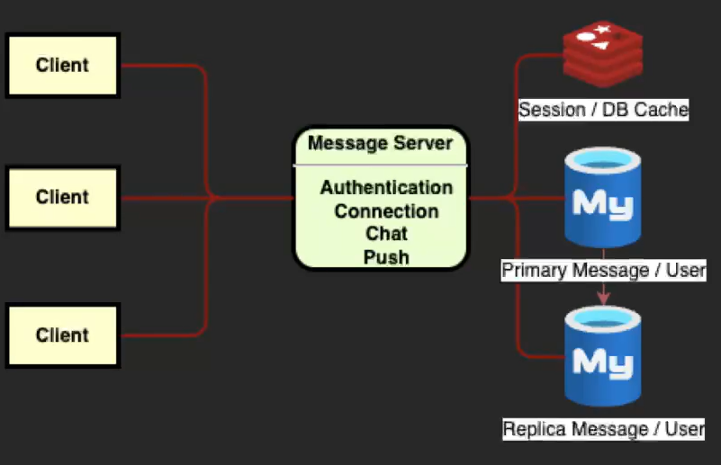

# WebSocket 기반 실시간 메세지 서버

- 실시간 메세지 시스템을 멀티모듈로 구현한 프로젝트 입니다.
- JLine CLI 클라이언트와 WebSocket 서버로 구성되어 있습니다.
- 로그인 세션 및 채널 입장 정보 저장을 위해 Redis 를 사용합니다.
- 서비스 간 이벤트 기반 통신을 위해 Kafka 를 적용했습니다. 

### 실행 화면


## 🧑‍💻 Tech Stack

|   구분   | 기술명                                                                                             |
|:------:|:------------------------------------------------------------------------------------------------|
| Common | - Java 17.0.13 (Eclipse Temurin)                                                                |
| Client | - JLine 3.28.0 (CLI 클라이언트) <br/> - Tyrus 2.2.0 (WebSocket Engine)                               |
| Server | - SpringBoot 3.4.11 (LTS) <br/> - Spring Security <br/> - WebSocket <br/> - Spock 4 (테스트 프레임워크) |
| Infra  | - MySQL 8.0.40 (RDB) <br/> - Redis 7.4.1                                                        |

> Tyrus = Jakarta WebSocket(JSR 356)의 표준 구현체

### 🗂️ 프로젝트 구조

```
message-system/
├── message-system-infra/ # Nginx, Redis, Kafka 도커컴포즈 파일
├── message-system-client/ # 클라이언트 모듈
├── message-system-auth-server/ # 인증 서버
├── message-system-push-server/ # 푸시 알림 서버
├── message-system-server/ # 메세지 서버
```

### Server Architecture

#### 모놀리식 아키텍처 (기존)



#### 인증 및 알림서버 분리 


### 📄 Server API Spec

| 구분 |     URL     | METHOD | 기능   |
|:--:|:-----------:|:------:|:-----|
| 인증 |  /register  |  POST  | 회원가입 |
| 인증 | /unregister |  POST  | 회원삭제 |

## 채팅 클라이언트 CLI 명령어

### 프로그램 시작 명령어

```shell
$ cd message-system // 프로젝트 폴더 이동

# 서버 실행
$ ./gradlew bootRun // 서버 시작

# 클라이언트 실행
$ ./client-build.bat // 클라이언트 빌드
$ ./client-run.bat // 클라이언트 시작
```

### CLI 터미널 명령어

```shell
# 사용자 명령어
$ /register [username] [password] : 회원 가입 
$ /unregister : 회원 탈퇴
$ /login [username] [password] : 로그인
$ /logout : 로그아웃

# 채팅 명령어
$ /invite-code user : 사용자 초대코드 확인
$ /invite-code channel [channelId] : 채널 초대 코드 확인
$ /invite [inviteCode] : 연결 초대 
$ /accept [username] : 연결 수락
$ /reject [username] : 연결 거절
$ /disconnect [username] : 연결 해제
$ /connections : 연결 리스트
$ /pending : 연결 대기 리스트
$ /channels : 채널 리스트
$ /create [title] [username1] [username2] ... : 채널 생성
$ /join [inviteCode] : 초대코드 채널 입장
$ /enter [channelId]: 채널 입장
$ /leave : 나가기
$ /quit [channelId] : 채널 탈퇴

# 터미널 명령어
$ /clear : 터미널 초기화
$ /exit : 로그아웃 후 종료
```

---

# 📖 메세징 서버 관련 지식

## 비관적 락(Pessimistic Lock) 적용 및 동시성 제어 설계

> 멀티스레드 환경에서 동일 리소스에 대해 여러 트랜잭션이 동시에 **조회 → 검증 → 변경**을 수행할 경우,  
> 카운트 기반 상태 값이 잘못 저장되는 오류를 방지하기 위해 비관적 락(`PESSIMISTIC_WRITE`)을 사용한다.

### UserConnection

* Entity: `UserEntity`
* Field: `connectionCount`

| 구분    | 내용                                  |
|-------|-------------------------------------|
| 발생 오류 | Lost Update, limit 검증 무력화           |
| 원인    | 다중 트랜잭션의 동시 accept / disconnect     |
| 해결    | `PESSIMISTIC_WRITE`로 단일 트랜잭션만 수정 허용 |

### 예시 코드

```java
// UserRepository
@Lock(LockModeType.PESSIMISTIC_WRITE)
Optional<UserEntity> findForUpdateByUserId(Long userId);
```

```java
// UserConnectionLimitService
@Transactional
public void accept(UserId userId) {
    UserEntity user = userRepository.findForUpdateByUserId(userId.id())
            .orElseThrow();

    if (user.getConnectionCount() >= LIMIT) {
        throw new IllegalStateException("limit exceeded");
    }

    user.setConnectionCount(user.getConnectionCount() + 1);
}
```

### Channel

* Entity: `ChannelEntity`
* Field: `headCount`

| 구분    | 내용                             |
|-------|--------------------------------|
| 발생 오류 | 정원 초과 참여, 인원 수 불일치             |
| 원인    | 다중 join / quit 요청의 동시 처리       |
| 해결    | `PESSIMISTIC_WRITE`로 상태 변경 직렬화 |

### 예시 코드

```java
// ChannelRepository
@Lock(LockModeType.PESSIMISTIC_WRITE)
Optional<ChannelEntity> findForUpdateByChannelId(Long channelId);
```

```java
// ChannelService
@Transactional
public ResultType join(ChannelId channelId, UserId userId) {
    ChannelEntity channel = channelRepository
            .findForUpdateByChannelId(channelId.id())
            .orElseThrow();

    if (channel.getHeadCount() >= LIMIT_HEAD_COUNT) {
        return ResultType.OVER_LIMIT;
    }

    channel.setHeadCount(channel.getHeadCount() + 1);
    return ResultType.SUCCESS;
}
```

> 카운트 기반 상태 변경 로직에서 발생하는 동시성 오류를 구조적으로 차단하기 위해,   
> 제한된 범위에 비관적 락을 적용하여 데이터 정합성을 보장

## 낙관적 락(Optimistic Lock) vs 비관적 락(Pessimistic Lock)

| 구분      | 낙관적 락 (Optimistic)         | 비관적 락 (Pessimistic) |
|---------|----------------------------|---------------------|
| 기본 개념   | 충돌이 없을 것이라 가정              | 충돌이 발생한다고 가정        |
| 적용 방식   | 커밋 시 버전 충돌 감지 (`@Version`) | 조회 시 즉시 DB 락 획득     |
| 충돌 시 처리 | 예외 발생 후 재시도 필요             | 다른 트랜잭션 대기          |
| 동시성 오류  | 사후 감지                      | 사전 차단               |
| 재시도 로직  | 필요                         | 불필요                 |
| 적합한 상황  | 읽기 많고 충돌 적음                | 상태 변경·경합 잦음         |

## 락 사용시 발생 가능한 문제점

| 문제 유형              | 정의                               | 발생 원인                 | 시스템 영향            | 대응 방안                   |
|--------------------|----------------------------------|-----------------------|-------------------|-------------------------|
| 데드락 (Deadlock)     | 트랜잭션들이 서로의 락을 점유한 채 무한 대기 상태에 빠짐 | 서로 다른 리소스에 대해 교차 락 획득 | 트랜잭션 정지, DB 강제 롤백 | 락 획득 순서 고정, 단일 엔티티 락 원칙 |
| 기아 상태 (Starvation) | 특정 트랜잭션이 지속적으로 락을 획득하지 못함        | 짧은 트랜잭션의 반복적인 락 선점    | 일부 요청 지연, 응답 불균형  | 트랜잭션 최소화, 락 범위 제한       |
| 성능 저하              | 락 대기로 전체 처리량 감소                  | 높은 동시성 + 긴 락 유지 시간    | TPS 감소, 응답 지연     | 상태 변경 구간에만 락 적용         |
| 락 범위 확장            | Row 락이 Table 락으로 확장됨             | 다수 Row 동시 락           | 비관련 트랜잭션 차단       | PK 기반 단건 조회             |
| 장애 전파              | 락 대기가 연쇄적으로 확산                   | 병목 트랜잭션 존재            | 서비스 지연 확대         | 타임아웃 설정, 예외 처리          |

---

## 네트워크 브로드캐스트와 웹소켓 브로드캐스트
> 브로드캐스트 : 농사할 때 씨앗을 밭에 흩뿌리는 모습   
> 농사 -> 라디오, 방송 -> IT로 용어가 전파됨

|    구분     |                       네트워크 브로드캐스트                        |                        웹소켓 서버 브로드캐스트 (멀티플 유니캐스트)                         |
|:---------:|:--------------------------------------------------------:|:------------------------------------------------------------------------:|
|   동작 계층   | L2(Data Link) / L3(Network) 스위치 <br/> 라우터 등 하위 계층 패킷 전송  | L4(Transport) / L5(Session) / L7(Application) Layer <br/> TCP 위 웹소켓 프로토콜 |
| 라우터 통과 여부 |               라우터는 기본적으로 브로드캐스트 원격지 전파 차단                |                                원격지로 전파 가능                                |
|  패킷 목적지   | 브로드캐스트 주소 <br/> (ex: 255.255.255.255 or 192.168.1.255 등) |                                각 클라이언트 소켓                                |
|  메세지 전달   |       논리적으로 한 번의 브로드 캐스트 <br/> 네트워크 내 모든 호스트 패킷 전파       |                    각 클라이언트 소켓으로 유니캐스트 <br/> 개별 전송 반복                     |
|   사용 예    |                       ARP, DHCP 등                        |                           그룹 채팅 메세지, 알림 시스템 등                            |

> - ARP(Address Resolution Protocol) : 특정 Host IP를 알지만 MAC Address 를 모를때 ARP 패킷 전파,  
    > IP 로 MAC Address 를 알 수 있음 (+RARP : MAC Address 를 알 때, RARP로 IP 주소 할당, 지금은 DHCP가 대체)
> - DHCP(Dynamic Host Configuration Protocol) : 네트워크 내 DHCP 서버가 IP 주소와 관련 네트워크 설정을 자동으로 클라이언트에 할당해 주는 프로토콜 (공유기/라우터 등에
    내장)   
